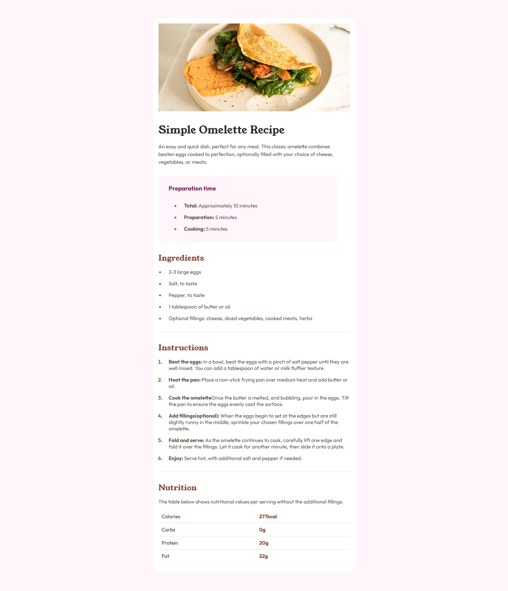

# Frontend Mentor - Recipe page solution

This is a solution to the [Recipe page challenge on Frontend Mentor](https://www.frontendmentor.io/challenges/recipe-page-KiTsR8QQKm). Frontend Mentor challenges help you improve your coding skills by building realistic projects.

## Table of contents

- [Overview](#overview)
  - [The challenge](https://www.frontendmentor.io/challenges/recipe-page-KiTsR8QQKm)
  - [Screenshot](./Screenshot.png)
  - [Links](https://www.frontendmentor.io/solutions/omelette-recipe-page-html-sass-fvuY-0uNuh)

## Overview

### Screenshot



### Links

- Solution URL: [Solution URL](https://www.frontendmentor.io/solutions/omelette-recipe-page-html-sass-fvuY-0uNuh)
- Live Site URL: [Live Site URL](https://limsael.github.io/recipe-page/)

## My process

### Built with

- Semantic HTML5 markup
- CSS custom properties
- Mobile-first workflow

### What I learned

```css
 &__table {
    width: 100%;
    border-collapse: collapse;

    td {
      border-bottom: 1px solid $light-grey;
      padding: 0.625rem;
      font-weight: 500;
      color: $wenge-brown;
    }

    .nutmeg {
      color: $nutmeg;
      font-weight: 700;
    }

    tr {
      &:last-of-type td {
        border: none;
      }
    }
```

### Useful resources

- [Modzilla Developper Network](https://developer.mozilla.org/en-US/) - This helped me for pseudo-classes and pseudo-elements. I'd recommend it to anyone still learning this concept.

## Author

- Frontend Mentor - [@limsael](https://www.frontendmentor.io/profile/limsael)
- Twitter - [@limsael525](https://www.twitter.com/limsael525)
